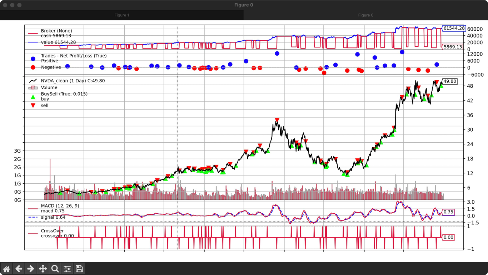

# GoldenCross 量化交易&回测系统

## 项目简介

本项目是一个基于 Python、Backtrader 和 yFinance 的 MACD 股票量化交易回测系统。它能够自动获取股票数据、计算 MACD 指标、生成交易信号，并使用
Backtrader 进行策略回测，最终绘制交易信号和回测结果。

该项目采用 模块化结构，使代码更易于维护和扩展，并支持命令行运行完整回测流程。



[量化交易基础知识](doc/basic_knowledge.md)

## 功能特点

- 自动获取股票数据（支持 Yahoo Finance 数据源）
- 计算 MACD 指标（包含 DIF、DEA 和柱状图）
- 生成交易信号（MACD 金叉买入、死叉卖出）
- 回测交易策略（使用 Backtrader 进行模拟交易）
- 可视化 MACD 指标及交易信号
- 资金管理（控制买入比例，计算持仓）
- 模块化设计，便于扩展和修改

## 目录结构

```
macd_backtest/
│── macd_backtest/            # 主 Python 包
│   ├── __init__.py
│   ├── data_fetcher.py        # 获取数据
│   ├── indicators.py          # 计算 MACD
│   ├── signals.py             # 生成交易信号
│   ├── plotter.py             # 绘制 MACD 及交易信号
│   ├── strategy.py            # Backtrader 交易策略
│   ├── backtest.py            # 执行回测
│── scripts/                   # 可执行的 Python 脚本
│   ├── run_backtest.py        # 运行完整的回测流程
│── tests/                     # 测试代码
│   ├── test_indicators.py
│   ├── test_signals.py
│── data/                      # 存放下载的 CSV 数据
│── logs/                      # 存放日志
│── config/                    # 配置文件（可选）
│── requirements.txt           # Python 依赖
│── README.md                  # 项目说明

```

## 安装依赖

在运行项目前，需要安装必要的 Python 依赖：

```bash
pip install -r requirements.txt
```

## 如何使用

1. 运行完整回测流程

```bash
python scripts/run_backtest.py --ticker NVDA
```

其中 --ticker 参数指定要回测的股票代码（默认为 NVDA）。

2. 手动调用各模块

- 获取数据

```python
from macd_backtest.data_fetcher import get_stock_data

df = get_stock_data("AAPL")
```

- 计算 MACD

```python
from macd_backtest.indicators import compute_macd

df = compute_macd(df)
```

- 生成交易信号

```python
from macd_backtest.signals import generate_signals

df = generate_signals(df)
```

- 绘制 MACD

```python
from macd_backtest.plotter import plot_macd

plot_macd(df)
```

- 运行回测

```python
from macd_backtest.backtest import run_backtest

run_backtest("AAPL")
```

---

## 适用人群

- 📌量化交易初学者：想要学习 Python 交易策略开发的用户
- 📌数据分析师：希望深入研究 MACD 指标及交易信号
- 📌投资爱好者：想要测试交易策略，提高投资收益

---

## 未来优化

- 🔹支持更多技术指标（如 RSI、布林带）
- 🔹增加策略参数优化（网格搜索最佳参数）
- 🔹添加 GUI 界面，提升用户体验

🎯 如果你对量化交易感兴趣，欢迎一起优化这个项目！🚀